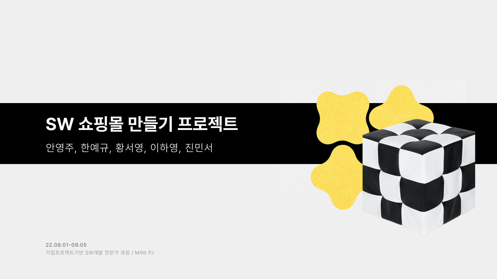

# **Sopoom 쇼핑몰 사이트 제작 프로젝트**

  

 

## **Period**
> 2022/08/09 - 2022/08/30
 

---

## **Info.**
- 5인 팀 프로젝트
- 회원가입, 장바구니, 찜하기, 탈퇴하기, 관리자 페이지 등의 기능이 있는 쇼핑몰 제작.
 

---
## **Summury**
### 개발 환경

  

- 개발 언어: Java 11
- 동적 웹 구현: JSP (JavaServer Pages)
- DB: MariaDB, Mybatis
- Web Server: Apache tomcat 9
- IDA : Eclips
- 협업 / 디자인 툴 : Figma
 

---

### **Header** : User Role 에 따른 접근 페이지 변화

  

- Role 에 상관 없는 접근 페이지 : 랜딩, 로그인, 상품 정보 페이지
- 관리자 기능: 상품 등록, 재고관리, 회원관리, 배송관리
- 회원 기능: 상품 주문, 쇼핑카트, 결제, 마이페이지 주문정보 확인
- 비회원 기능: 회원가입

### **Database Schema**: Table 설명

  

**Table** 
User, Product, Cart, Order, Ordereditem, Shipping  
각 페이지에 필요한 기능을 User Flow Map 을 이용해 분석후 필요한 DB를 설계하였다.

User
> PK) userid
> >기본적인 유저 정보/주소 정보 저장 테이블

Product:
> PK) p_id(제품id)
>> 제품 정보와 관련된 img file의 경로를 저장하는 테이블

Cart:
> FK) user table - userID, cart table - p_ID
>> 유저가 카트에 담은 물건 정보를 저장하는 테이블
Order
> PK) orderID
>> 주문한 유저 아이디와 총 주문 가격, 주문 날짜가 저장되는 테이블

Ordereditem
>FK) order table - orderID, product table - p_id
>> 유저가 주문한 제품내역이 저장되는 테이블

Shipping
> PK) shipID FK)order table- orderID
>> 주문한 유저의 기본적인 정보와 결제 완료 내역이 저장되는 테이블

---
## **Contants**

### **공통 기능**

로딩-랜딩 페이지

  

  

 

카테고리 드롭다운 메뉴

  

 

제품 상세 페이지

  

 

로그인 / 회원가입

  

  

  

  

  

  

 

### **회원 기능**

장바구니

  

  

  

  

  

  

 

주문/결제

  

  

 

마이페이지

  

  

  

 

배송 정보

  

  

 

### **관리자 기능**

상품 등록

  

  

 

재고 관리

  

  

 

회원 관리

  

  

 

배송 관리

  

 

  

  

---
