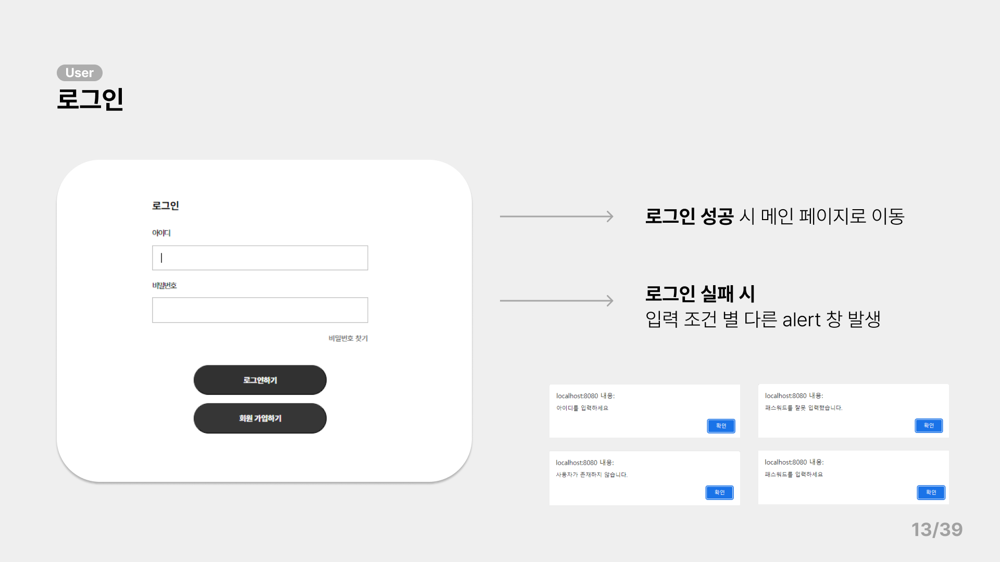
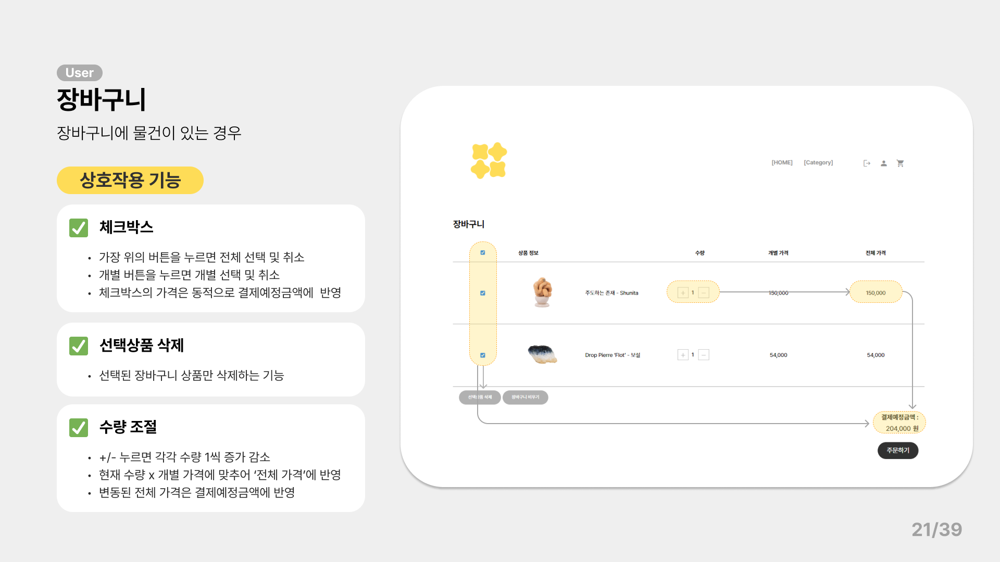

# **Sopoom: 쇼핑몰 사이트 제작 프로젝트**

  

 

## 🗓**Period**
> 2022/08/09 - 2022/08/30
 

## ℹ️**Info.**
- 5인 팀 프로젝트
- 회원가입, 장바구니, 찜하기, 탈퇴하기, 관리자 페이지 등의 기능이 있는 쇼핑몰 제작.
 

## ✏️**Summury**

### **1. 개발 환경**

  

    - 개발 언어: Java 11 
    - 동적 웹 구현: JSP (JavaServer Pages) 
    - DB: MariaDB, Mybatis 
    - Web Server: Apache tomcat 9 
    - IDA : Eclips 
    - 협업 / 디자인 툴 : Figma

### **2. Header** : User Role 에 따른 접근 페이지 변화

  

    - Role 에 상관 없는 접근 페이지 : 랜딩, 로그인, 상품 정보 페이지
    - 관리자 기능: 상품 등록, 재고관리, 회원관리, 배송관리
    - 회원 기능: 상품 주문, 쇼핑카트, 결제, 마이페이지 주문정보 확인
    - 비회원 기능: 회원가입

### **3. Database Schema**: Table 설명

  

#### **1. User**
> PK) userid
기본적인 유저 정보/주소 정보 저장 테이블

#### **2. Product**
> PK) p_id(제품id)
>
제품 정보와 관련된 img file의 경로를 저장하는 테이블

#### **3. Cart**
> FK) user table - userID, cart table - p_ID
>
유저가 카트에 담은 물건 정보를 저장하는 테이블

#### **4. Order**
> PK) orderID
>
주문한 유저 아이디와 총 주문 가격, 주문 날짜가 저장되는 테이블

#### **5. Ordereditem**
>FK) order table - orderID, product table - p_id

유저가 주문한 제품내역이 저장되는 테이블

#### **6. Shipping**
> PK) shipID FK)order table- orderID
>
주문한 유저의 기본적인 정보와 결제 완료 내역이 저장되는 테이블

## **Contants**

### **공통 기능**

로딩-랜딩 페이지

  

  

카테고리 드롭다운 메뉴

  

제품 상세 페이지

  

로그인 / 회원가입

  

  

  

  

  

  

---

### **회원 기능**

장바구니

  

  

  

  

  

  

주문/결제

  

  

마이페이지

  

  

  

배송 정보

  

  

---

### **관리자 기능**

상품 등록

  

  

재고 관리

  

  

회원 관리

  

  

배송 관리

  

---

### **이후 발전 방향**
1. 상세페이지 아래에 상품 리뷰란 추가
2. 카트에 담은 이후 취소하면 찜하기 항목에 추가 유도
3. 매출 분석 기능 추가

---

### 💻 **개발자**
**안영주**

> 전체적인 관리자 기능, 배송 정보, 찜하기, 렌딩 페이지
 

**한예규**

> 주문/결제, 로그인-로그아웃, 비밀번호 찾기, 헤더-풋터
 

**황서영**

> 장바구니, 마이페이지, 카테고리, 드롭다운 메뉴
 

**이하영**

> 전체적인 관리자 기능
 

**진민서**

> 렌딩 페이지, 제품 상세 페이지
 
